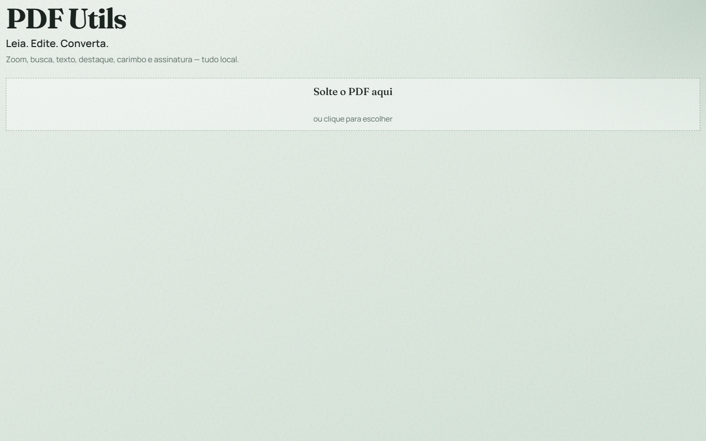
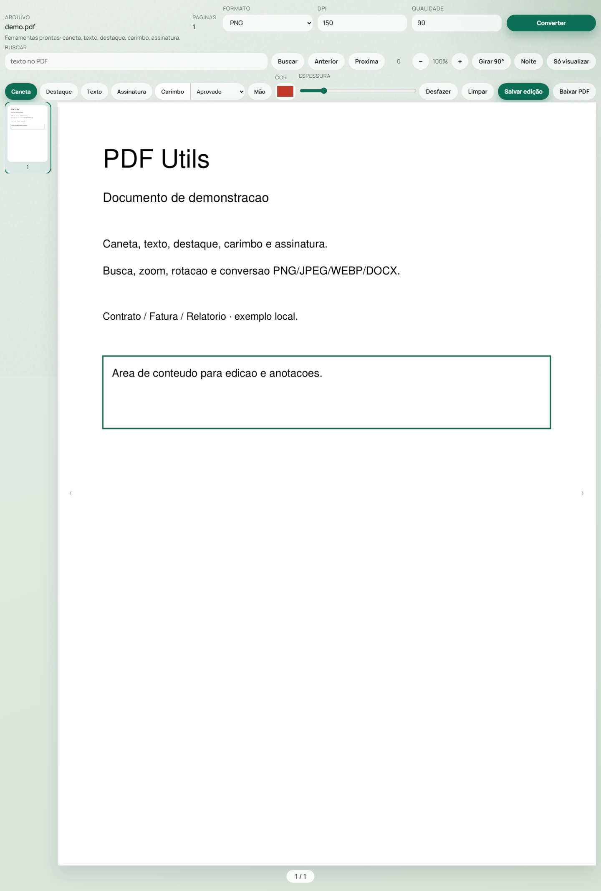
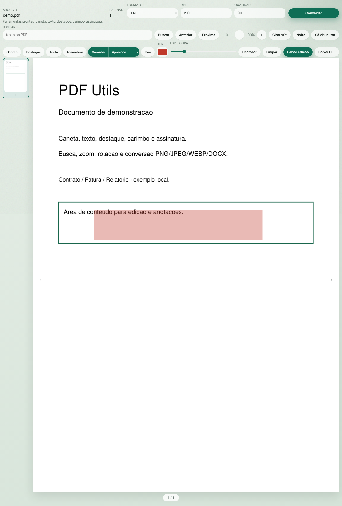

# PDF Utils

[](https://github.com/ramonmachadocarmo/pdf-utils/stargazers)
[](https://github.com/ramonmachadocarmo/pdf-utils/network/members)
[](https://github.com/ramonmachadocarmo/pdf-utils/issues)
[](https://github.com/ramonmachadocarmo/pdf-utils/commits/main)
[](https://www.python.org/)
[](https://fastapi.tiangolo.com/)
[](https://github.com/sponsors/ramonmachadocarmo)

Leitor e editor **local** de PDF: caneta, texto, destaque, carimbo, assinatura, busca, zoom, rotacao e conversao para PNG, JPEG, WEBP ou DOCX.

Tudo roda na sua maquina — o arquivo nao e enviado para a nuvem.

## Screenshots







## Funcionalidades

### Leitura
- Preview pagina a pagina com miniaturas
- Zoom in/out e arrastar com a ferramenta **Mao**
- Busca de texto com navegacao entre ocorrencias
- Rotacao de pagina em 90°
- **Modo noite**
- **So visualizar** — esconde a interface para leitura focada

### Edicao
| Ferramenta | O que faz |
|------------|-----------|
| **Caneta** | Traço livre (cor e espessura ajustaveis) |
| **Destaque** | Retangulo semitransparente |
| **Texto** | Insere texto livre no ponto clicado |
| **Assinatura** | Traço em azul, pensado para assinar |
| **Carimbo** | `Aprovado`, `Pago` ou data do dia |
| **Mao** | Pan/arraste do viewport |

- **Desfazer** remove a ultima edicao (ordem de criacao)
- **Limpar** remove as edicoes da pagina atual (ainda nao salvas)
- **Salvar edicao** grava as anotacoes no PDF de trabalho
- **Baixar PDF** baixa o arquivo atualizado

### Conversao
| Formato | Observacao |
|---------|------------|
| PNG / JPEG / WEBP | Uma imagem por pagina (ZIP se multiplas) |
| DOCX | Export via `pdf2docx` |

Parametros na UI: `formato`, `dpi` (72–600) e `qualidade` (1–100, imagens).

## Requisitos

- [pyenv](https://github.com/pyenv/pyenv) (ou pyenv-win no Windows)
- Python **3.13.11** (definido em `.python-version`)
- [Poetry](https://python-poetry.org/) (instalado pelo `make setup`)
- `make` disponivel no PATH

## Configuracao

O projeto usa Poetry com virtualenv **dentro do repo** (`.venv`).

### Setup completo (recomendado)

```bash
make setup    # instala Python 3.13.11 via pyenv + Poetry
make install  # cria .venv e instala dependencias
```

### O que cada passo faz

| Comando | Efeito |
|---------|--------|
| `make setup` | `pyenv install 3.13.11`, `pyenv local`, instala Poetry nesse Python, ativa `virtualenvs.in-project` |
| `make install` | Garante `.venv`, aponta o Poetry para ele e roda `poetry install` |
| `make clean` | Remove `.venv`, caches e arquivos em `storage/` |

### Dependencias principais

- **FastAPI** + **Uvicorn** — API e UI estatica
- **PyMuPDF** — leitura, preview, busca, anotacoes e rotacao
- **pdf2docx** — export DOCX
- **Pillow** — suporte a formatos de imagem

### Armazenamento local

Arquivos temporarios ficam em `storage/`:

```text
storage/
  uploads/<job_id>/source.pdf    # PDF original
  uploads/<job_id>/working.pdf   # PDF com edicoes salvas
  outputs/<job_id>/              # resultados de conversao
```

O diretorio e limpo com `make clean` (mantem `.gitkeep`).

## Como rodar

```bash
make dev    # hot reload — desenvolvimento
make run    # servidor sem reload
```

Abra [http://127.0.0.1:8000](http://127.0.0.1:8000).

Docs interativas da API: [http://127.0.0.1:8000/docs](http://127.0.0.1:8000/docs).

## Como usar a interface

1. **Abrir PDF** — solte o arquivo na area tracejada ou clique para escolher.
2. **Navegar** — miniaturas a esquerda, setas ou indicadores de pagina.
3. **Buscar** — digite o termo, use **Buscar** / **Anterior** / **Proxima**.
4. **Zoom** — botoes `−` / `+`; use **Mao** para arrastar.
5. **Editar** — escolha a ferramenta na barra, desenhe ou clique no documento.
6. **Carimbo** — selecione o tipo (`Aprovado` / `Pago` / `Data`) e clique na pagina.
7. **Salvar** — **Salvar edicao** aplica no PDF de trabalho; **Baixar PDF** faz o download.
8. **Converter** — escolha formato/DPI/qualidade e clique em **Converter**.
9. **Leitura limpa** — **So visualizar** esconde chrome; **Mostrar interface** volta.

Dicas:
- Edicoes so entram no arquivo depois de **Salvar edicao**.
- Trocar de pagina preserva edicoes nao salvas em memoria por pagina.
- **Desfazer** respeita a ordem em que voce criou cada item.

## Testes

```bash
make test
```

Equivalente a `poetry run pytest -q`. Os testes cobrem upload, preview, busca, anotacao, rotacao, conversao e modelos de dominio.

## API

Base: `/api`

| Metodo | Rota | Descricao |
|--------|------|-----------|
| `POST` | `/api/upload` | Envia PDF (`multipart/form-data`, campo `file`) → `{ job_id, filename, page_count, ... }` |
| `GET` | `/api/preview/{job_id}/{page}` | Preview PNG da pagina (`?dpi=160`) |
| `GET` | `/api/search/{job_id}?q=` | Busca texto → lista de hits normalizados |
| `POST` | `/api/annotate/{job_id}` | Grava edicoes (strokes, texts, highlights, stamps) |
| `POST` | `/api/rotate/{job_id}` | Rotaciona pagina (`page_index`, `degrees`) |
| `GET` | `/api/download/{job_id}` | Baixa o PDF de trabalho |
| `POST` | `/api/convert/{job_id}` | Converte (`format`, `dpi`, `quality`) |

Exemplo de upload:

```bash
curl -F "file=@documento.pdf" http://127.0.0.1:8000/api/upload
```

Exemplo de conversao:

```bash
curl -X POST "http://127.0.0.1:8000/api/convert/<job_id>" \
  -F "format=png" \
  -F "dpi=150" \
  -F "quality=90" \
  -o saida.zip
```

## Estrutura do projeto

```text
app/
  api/          # rotas e schemas
  domain/       # modelos de dominio
  services/     # reader, editor, converter
  static/       # UI (HTML/CSS/JS)
  config.py     # paths (storage, static)
  main.py       # FastAPI app
docs/screenshots/
tests/
storage/        # uploads e outputs (runtime)
```

## Comandos Make

```text
make help      Lista comandos
make setup     Python + Poetry
make install   Dependencias no .venv
make run       Servidor
make dev       Servidor com reload
make test      Pytest
make clean     Limpa venv/cache/storage
```

## Support

Se o projeto te ajudar, considere patrocinar:

[](https://github.com/sponsors/ramonmachadocarmo)
